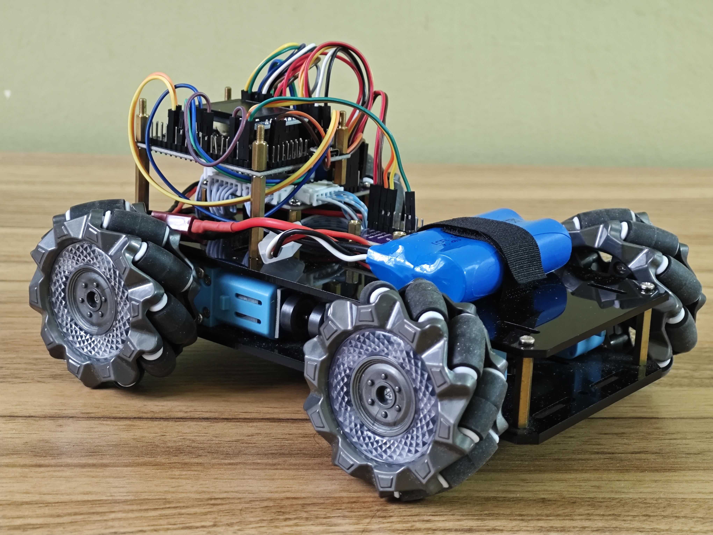

# STM32 Mini Mecanum Wheel Robot

A mini mecanum wheel robot built around the **STM32F407VGT6**, featuring closed-loop motor speed PID control and orientation PID for robust omnidirectional movement — including a full **Field-Oriented Control (FOC)** drive mode.

---

## ✨ Features

- **Omnidirectional Drive** — Full mecanum wheel holonomic movement (forward, lateral, diagonal, rotation)
- **Motor Speed PID** — Per-wheel encoder feedback ensures balanced wheel speeds for smooth, accurate motion
- **Orientation PID (Yaw correction)** — Overcomes the skidding issue where the robot body drifts or slips in an unintended direction, using the IMU heading to actively correct course
- **Absolute Field-Oriented Control (FOC) Mode** — The robot moves in the direction you command relative to the *field/world frame*, regardless of the robot's current heading
- **On-board Display** — Real-time telemetry and PID menu on a 1.3" ST7789 LCD
- **Dual MCU Architecture** — STM32 handles motor control and kinematics; ESP32 handles wireless communication

---

## 🎬 Demo Videos
Click the picture to watch the video

| Video | Description |
|---|---|
| <a href="https://www.youtube.com/watch?v=DZKMX0H58ZI"></a> | Yaw PID orientation correction in action |
| <a href="https://youtu.be/A75sVBpRvhQ"></a> | Absolute field-oriented control demo |
| <a href="https://youtu.be/tIPLqOVqF0E"></a> | Circular movement without PID (drift visible) |
| <a href="https://youtu.be/zL731xuKqPI"></a> | Circular movement with PID |
| <a href="https://youtu.be/0gELg2SBPxo"></a> | Lateral movement without PID (drift visible) |
| <a href="https://youtu.be/wuhcH3w_rd0"></a> | Lateral movement with orientation PID active |
| <a href="https://youtu.be/lcQUk2T1LM4"></a> | On-board PID tuning menu on LCD |

---

## 🔧 Hardware

| Component | Details |
|---|---|
| **Microcontroller** | STM32F407VGT6 |
| **Wireless Module** | ESP32 |
| **IMU** | BNO085 (rotation vector) |
| **Motor Driver** | TB6612FNG module |
| **Motors** | 4× TT Motor with encoder |
| **Wheels** | 68mm plastic mecanum wheels |
| **Display** | 1.3" LCD (ST7789 driver) |
| **Battery** | 2S 18650 Li-ion |

---

## 🧠 Control Architecture

```
         ┌─────────────────────────────────────────────┐
         │                STM32F407VGT6                │
         │                                             │
 ESP32  ──►  Joystick Input / Drive Mode Select        │
 BNO085 ──►  Yaw / Orientation Feedback                │
         │           │                                 │
         │    ┌──────▼──────┐                          │
         │    │ Orientation │  Yaw PID correction      │
         │    │    PID      │                          │
         │    └──────┬──────┘                          │
         │           │                                 │
         │    ┌──────▼──────┐                          │
         │    │  Mecanum    │  Inverse kinematics      │
         │    │  Kinematics │  (Normal / FOC mode)     │
         │    └──────┬──────┘                          │
         │           │  ω target per wheel             │
         │    ┌──────▼──────┐                          │
         │    │  Motor PID  │  Speed PID × 4 wheels    │
         │    └──────┬──────┘                          │
         └───────────┼─────────────────────────────────┘
                     │
              TB6612 Motor Driver
                     │
               ┌──┬──┴──┬──┐
              M1  M2   M3  M4
```

### Drive Modes

**Normal Omnidirectional Mode**
Robot translates and rotates based on raw joystick input in the robot's own body frame.

**Absolute Field-Oriented Control (FOC) Mode**
Using the BNO085's absolute heading, joystick commands are transformed into the world/field frame. The robot always moves in the intended real-world direction regardless of where its nose is pointing — ideal for remote control without needing to track robot heading manually.
